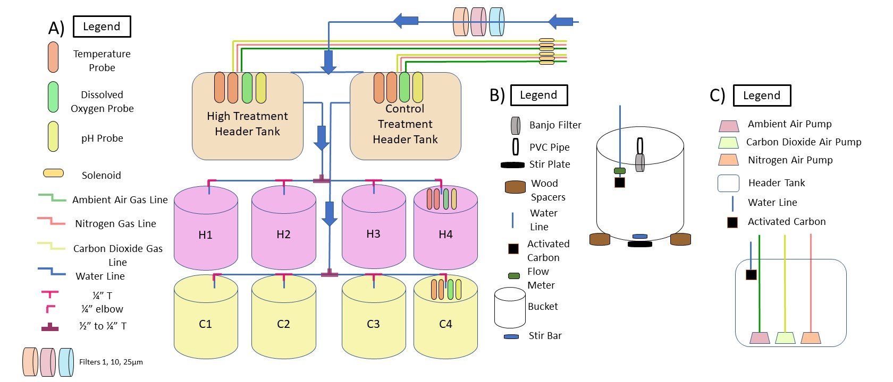
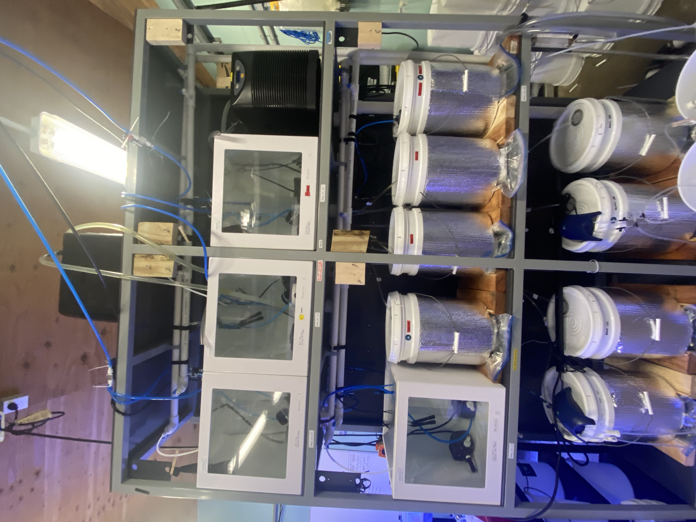
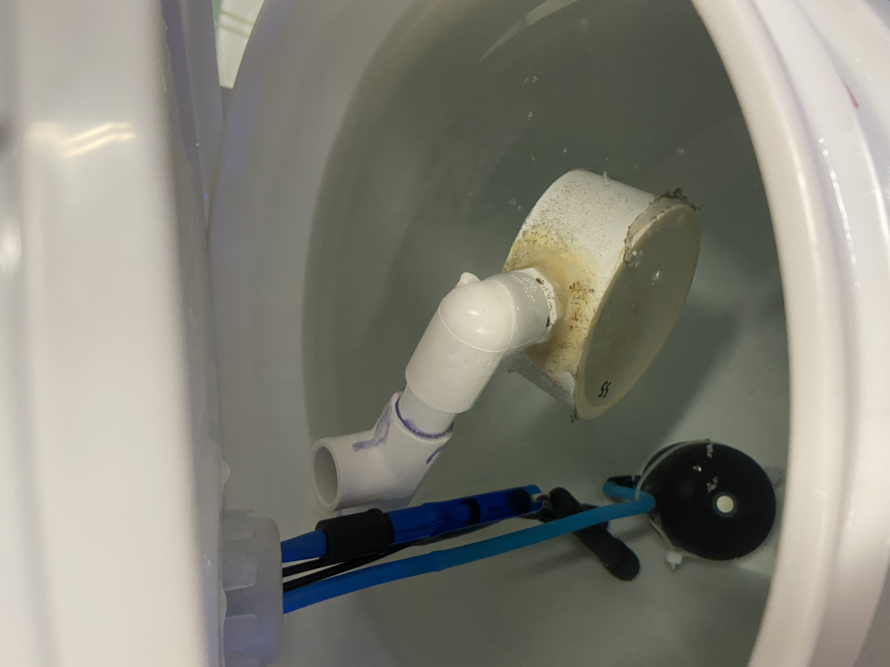
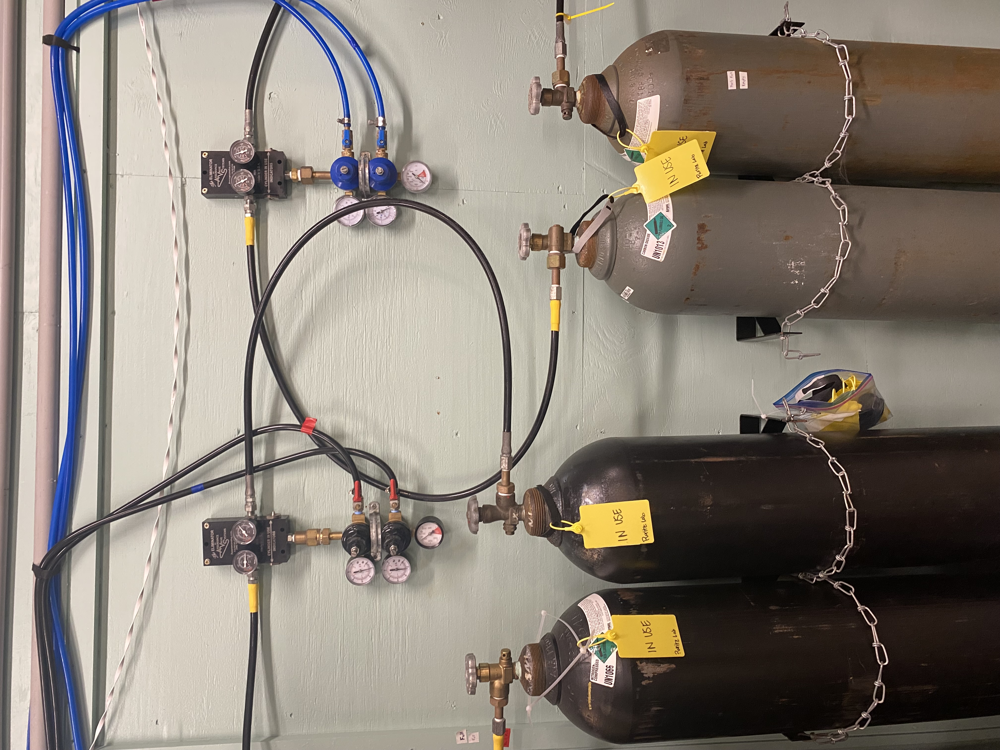
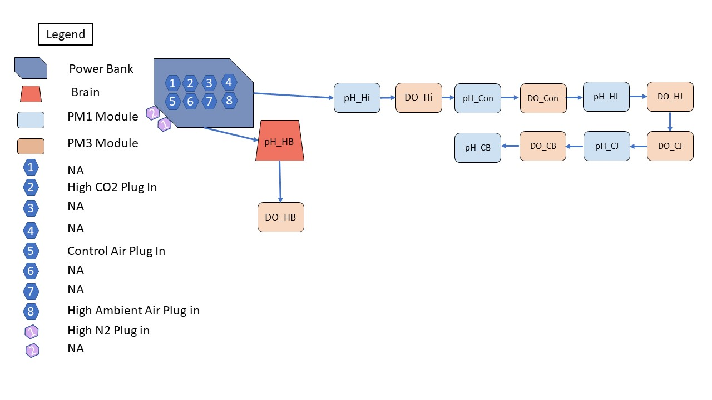
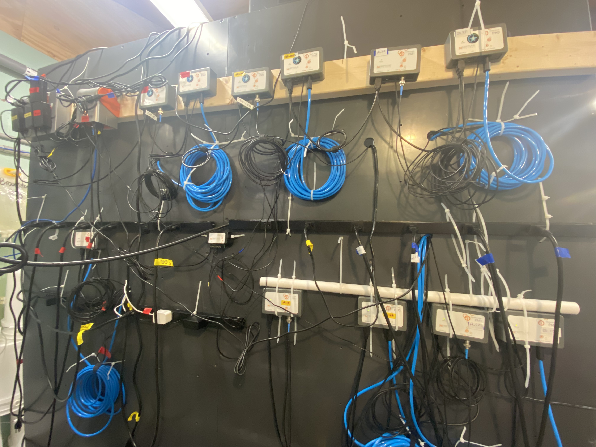

 

# Public Resources

**MarineEvoEcoLab/PublicResourceSection** provides information on the materials and methods used in experimental project. 


## Resource 1
### Experimental Flow-through Sea Water System to diurnally cycle pH and dissolved oxygen
This product includes a description of [system design](#System), [code](#Code), [list of parts](#Parts) paramount to the experiment. This work was funded by RI Sea Grant, the University of Rhode Island, and the USDA National Institute of Food and Agriculture, Hatch Formula project accession number 1017848.

[](https://seagrant.gso.uri.edu/research/2020-2022-research-2/)

 


### System Design
[](https://www.neptunesystems.com/)
#### Flow Through System



**Figure 1** **A)** Break down of system design. Seawater chemistry is altered within the header tanks, within which carbon dioxide and nitrogen gas are used to alter seawater pH and dissolved oxygen. Treated seawater (CO2 and N2 gas) is actively pumped from the high treatment header tank into buckets H1-H4. Unmodified water (Ambient Air) is actively pumped from the control treatment header tank into C1-C4. Buckets 1-3 contain larvae, whereas buckets with probes contain no larvae. **B)** Break down of bucket design. Seawater is actively pumped from the water line through a flow meter which is adjacent to activated carbon. a constant mixing of seawater is maintained with a stir bar/plate. Seawater is passively pumped out of the system through a banjo filter with filter sizes varying between 25 to 55 microns depending on larval development. **C)** Break down of header tank design. Seawater is pumped through 25, 10, and 1 micron filters respectively and into header tanks through an activated carbon sock. Within the header tanks ambient, Carbon Dioxide, and Nitrogen gas is actively pumped to achieve cycling of low/high pH and low/high Dissolved oxygen conditions. Conditioned water is continousley pumped from the header tanks into the buckets.


<p float="left">


</p>

**Tile 1** Photo of Hyrule on the left and Inside H4 bucket on the right.

<p align="center">

</p>

**Tile 2.** Tank configuration with N2 tanks on the right in black and CO2 tanks on the left in grey. Tanks are hooked up in a series to a automatic gas changeover eliminator valves, a micro matic 642, CO2 or neptune solenoids and water pump located within the head tanks. 
 

#### Neptune Hardware Layout

<p align="center">

</p>

**Figure 2.** Schematic showing the wiring of the neptune system used in the aquarium design to modulate modulate sea water chemistry. Arrows indicate USB connections with arrows pointing to source module.

<p align="center">

</p>

**Tile 3.** Neptune Configuration with power bank, brain, and modules used in the aquarium design. AirGas tanks are hooked up to a automatic Gas changeover eliminator valves 6091 which is then attached to 

### Code

#### Apex Fusion

Apex programming is designed to turn on or off devices plugged into Energy bars depending on logical arguments. For a tutorial on Apex programming and creating virtual outputs see [Neptune Apex Programming Tutorials, Part 5: Virtual Outputs](https://www.reef2reef.com/ams/neptune-apex-programming-tutorials-part-5-virtual-outputs.703/)

Below are real examples of virtual outputs design for manipulating seawater chemistry following diurnal cycling.

 **pH Control:**

<details close>
<summary>C02_H2_DEC</summary>
<br>

```
 Fallback OFF
 Set OFF
 OSC 000:00/000:05/000:20 Then ON
 If pH_Hi < 7.00 Then OFF
 If Time 20:30 to 20:00 Then OFF
 ```
</details>

<details close>
<summary> CO2_HC_LP</summary> 
<br>

```
 Fallback OFF
 Set OFF
 OSC 000:00/000:01/001:29 Then ON
 If pH_Hi < 7.01 Then OFF
 If Time 00:00 to 20:30 Then OFF
```
</details>


<details close>
<summary> CO2_HC_LP2 </summary>
<br>

```
 Fallback OFF
 Set OFF
 OSC 000:00/000:01/001:29 Then on
 If Time 03:00 to 00:00 Then OFF
 If pH_Hi < 7.05 Then OFF
```
</details>

<details close>

<summary> CO2_HC Port </summary>
<br>

 ```
Fallback OFF 
Set OFF
If Output CO2_HC_DEC = ON Then ON
If Output CO2_HC_LP = ON Then ON
If Output CO2_HC_LP2 = ON Then ON
If pH_Hi < 6.80 Then OFF
 ```
</details>

 

 **Dissolved Oxygen (DO)**

<details close>
<summary> N2_HC_LP</summary>
<br>

```
 Fallback OFF
 Set OFF
 If Time 00:00 to 03:00 Then ON
 If DO_Hi < 02.0 Then OFF
```
</details>


<details close>
<summary> N2_HC_INC</summary>
<br>

```
 Fallback OFF
 Set OFF
```
</details>


<details close>
<summary> N2_HC</summary>
<br>

 ```
 Fallback OFF
 Set OFF
 If Output N2_HC_LP = ON Then ON
 If Output N2_HC_INC = ON Then ON
 If Time 20:00 to 00:00 Then ON
 If DO_Hi < 01.5 Then OFF
 ```
</details>

**Ambient Air**

<details close>
<summary> HI_AIR</summary>
<br>

 ```
 Fallback OFF
 Set OFF
 If Time 03:00 to 20:00 Then ON
 ```
</details>


<details close>
<summary> CON_AIR</summary>
<br>

 ```
 Fallback OFF
 Set ON
 ```
</details>

#### Pulling Data From Apex Fusion

Logged data from Apex Fusion is archived and stored in XML format. For an overview of how to access this data see [chapter 10 of the comprehensive reference manual](https://www.neptunesystems.com/downloads/docs/Comprehensive_Reference_Manual.pdf).

An example of Pulling Apex Fusion Data in R as implemented in our aquatic design can be found [HERE](assets/docs/ApexDataPull.rmd).


### Parts


**Table 1.** Summary of parts and their model number used in the aquarium design. 
| Name                                            | Model #  |
|-------------------------------------------------|----------|
| Power Supply                                    | EB832    |
| Apex Controller Base Unit                       | APEXNG   |
| PM1 Module                                      | PM1      |
| PM3 Module                                      | PM3      |
| Temperature Probe                               | PRBTMPJR |
| Double Junction pH Probe                        | PRBPHDJ  |
| Oxygaurd Dissolved Oxygen Probe                 | PRBDO    |
| CO2 Solenoid                                    | MA955    |
| Neptune Solenoid                                | SV-1     |
| Magnetic Stirrer                                | MS5      |
| Pump                                            | E160713  |
| Automatic Gas Changeover Eliminator Valves      | 6091     |
| Micro Matic 642                                 | 6422     |
